# 1. Contexto base del proyecto

Primero deja una base estable que la IA consulte siempre.

## Archivos

* `docs/context.md`
* `docs/app-features/index.md`
* `docs/architecture.md`
* `docs/conventions.md`

## Qué debería tener

**`context.md`**

* contexto global breve
* objetivo del producto
* stack
* restricciones
* punteros al detalle funcional

**`docs/app-features/index.md`**

* índice de features funcionales
* guía para decidir qué fichas leer
* descripción breve de qué contiene cada feature

**`architecture.md`**

* módulos principales
* separación por capas
* decisiones técnicas ya tomadas
* límites entre componentes

**`conventions.md`**

* naming
* estructura de carpetas
* validación
* errores
* logs
* patrón de servicios, repositorios, controladores, etc.

---

# 2. Estándares y ejemplos

Esto sirve para que la IA no improvise estilo ni estructura.

## Carpetas

* `standards/`
* `examples/`

## En `standards/`

* `coding-style.md`
* `testing-rules.md`
* `error-handling.md`
* `security-basics.md` si aplica

## En `examples/`

* un servicio o caso de uso bien hecho
* un endpoint/controlador bien hecho
* un unit test bueno
* un integration test bueno

## Qué es importante

Los ejemplos deben ser:

* reales
* pequeños
* limpios
* coherentes con tu proyecto

---

# 3. Estructura por feature

Cada funcionalidad debería vivir en su carpeta.

## Carpeta

* `features/NNNN-feature-name/`

## Archivos

* `spec.md`
* `tasks.md`
* `test-plan.md`
* `notes.md` opcional

---

# 4. Paso 1: spec funcional

Aquí defines qué hay que construir.

## Lee

* `docs/context.md`
* `docs/app-features/index.md`
* `docs/architecture.md`
* `docs/conventions.md`

## Escribe

* `features/NNNN-feature-name/spec.md`

## Qué debe contener

* objetivo
* alcance
* no alcance
* requisitos funcionales
* requisitos no funcionales
* criterios de aceptación
* edge cases
* riesgos o dudas abiertas

## Importante

Aquí no conviene meter tareas técnicas todavía.

---

# 5. Paso 2: plan técnico

Aquí conviertes la spec en trabajo implementable, y ahora además ya dejas marcado el impacto documental.

## Lee

* `features/NNNN-feature-name/spec.md`
* `docs/context.md`
* `docs/app-features/index.md`
* `docs/architecture.md`
* `docs/conventions.md`
* `standards/`
* `examples/`

## Escribe

* `features/NNNN-feature-name/tasks.md`
* `features/NNNN-feature-name/test-plan.md`

## Qué debe contener `tasks.md`

Cada tarea debería tener como mínimo:

* objetivo
* dependencias
* tests requeridos
* documentación afectada
* criterio de finalización

Y dentro del criterio de finalización:

* cierre de implementación
* cierre documental

## Qué debe contener `test-plan.md`

* unit tests esperados
* integration tests esperados
* e2e si aplica
* qué comportamiento valida cada bloque

## Muy importante

Aquí es donde debes dejar esta regla:

* dividir en tareas más pequeñas cuando una tarea no pueda implementarse, probarse y revisarse de forma segura en un cambio acotado

Y además:

* cada tarea debe indicar qué ficheros de documentación hay que revisar o actualizar

---

# 6. Paso 3: implementación por tarea

Aquí la IA ejecuta una tarea concreta de código, no toda la feature.

## Lee

* `features/NNNN-feature-name/spec.md`
* `features/NNNN-feature-name/tasks.md`
* `features/NNNN-feature-name/test-plan.md`
* `docs/architecture.md`
* `docs/conventions.md`
* `standards/`
* `examples/`

Y solo si hace falta:

* `docs/context.md`
* `docs/app-features/index.md`
* las fichas funcionales relevantes

## Escribe o modifica

* código
* tests
* `features/NNNN-feature-name/notes.md` si hace falta

## Qué debe hacer

* coger una sola tarea
* escribir tests primero o en enfoque test-first
* implementar el mínimo necesario
* refactorizar si hace falta
* dejar claro qué documentación habrá que revisar después

## Importante

La salida de esta fase debería dejar:

* código hecho
* tests pasando
* documentación afectada identificada para la fase documental posterior
* estado de cierre de implementación listo

---

# 7. Paso 4: actualización de documentación

Aquí ya no se trabaja a ciegas, sino usando la documentación marcada en la planificación y el resultado real de la implementación.

En este flujo una tarea no tiene un único "terminado" monolítico. Tiene dos cierres explícitos:

* cierre de implementación: el código y los tests de la tarea ya están cerrados
* cierre documental: la documentación afectada por esa tarea ya está revisada y actualizada

La fase 3 cierra el primero. La fase 4 cierra el segundo.

## Lee

* `features/NNNN-feature-name/spec.md`
* `features/NNNN-feature-name/tasks.md`
* `features/NNNN-feature-name/test-plan.md`
* código cambiado
* tests cambiados
* `features/NNNN-feature-name/notes.md` si existe
* `docs/context.md`
* `docs/app-features/index.md`
* las fichas de `docs/app-features/` afectadas
* `docs/current-state.md` si existe
* `docs/api.md`
* `docs/runbook.md`
* `docs/architecture.md`
* `docs/conventions.md`
* `features/index.md` si existe

## Actualiza

* la documentación marcada como afectada en `tasks.md`
* `docs/api.md` si cambia contrato o endpoint
* `docs/runbook.md` si cambia operativa
* `docs/architecture.md` si cambia algo estructural
* `spec.md` si hay un ajuste válido respecto a la implementación real

## Importante

Actualizar solo lo afectado.

La tarea queda totalmente cerrada cuando:

* su cierre de implementación ya estaba completado
* su cierre documental queda actualizado en esta fase

---

# 8. Paso 5: revisión final

Aquí comparas lo pedido con lo implementado.

## Lee

* `features/NNNN-feature-name/spec.md`
* `features/NNNN-feature-name/tasks.md`
* `features/NNNN-feature-name/test-plan.md`
* código
* tests
* `docs/architecture.md`
* `docs/conventions.md`

## Escribe

* informe de revisión

## Qué revisa

* cumplimiento funcional
* tests faltantes
* desviaciones respecto a la spec
* incoherencias con arquitectura
* documentación pendiente
* deuda técnica

---

# 9. Validación automática mínima

Esto merece la pena dejarlo listo desde el principio.

## Necesitas

* lint
* unit tests
* integration tests
* build
* CI básica

Sin esto, el sistema queda demasiado apoyado en revisión manual.

---

# Cómo debería ser una tarea en `tasks.md`

Con el cambio nuevo, una tarea buena tendría esta pinta:

```md
## Tarea 3: Añadir endpoint POST /auth/login

Objetivo:
Implementar el endpoint de login y conectarlo con el caso de uso.

Dependencias:
- Caso de uso LoginUser
- Servicio de sesión

Tests requeridos:
- integration test del endpoint
- test de error por credenciales inválidas

Documentación afectada:
- docs/api.md
- features/0003-auth-login/spec.md

Criterio de finalización:
- cierre de implementación: endpoint operativo y tests pasando
- cierre documental: docs/api.md actualizada y spec revisada si el comportamiento final la obliga
```

---

# Estructura propuesta

## Versión bastante completa

```txt
/docs
  context.md
  architecture.md
  conventions.md
  api.md
  runbook.md
  onboarding.md

/standards
  coding-style.md
  testing-rules.md
  error-handling.md
  security-basics.md

/examples
  service-example.ts
  controller-example.ts
  unit-test-example.ts
  integration-test-example.ts

/features
  /NNNN-feature-name
    spec.md
    tasks.md
    test-plan.md
    notes.md
```

## Versión mínima

```txt
/docs
  context.md
  architecture.md
  conventions.md
  api.md

/standards
  testing-rules.md

/examples
  unit-test-example.ts
  integration-test-example.ts

/features
  /NNNN-feature-name
    spec.md
    tasks.md
    test-plan.md
```

---

# Mapa Mermaid actualizado

```mermaid
flowchart TD

    P1[Prompt 1: spec funcional]
    P2[Prompt 2: plan técnico]
    P3[Prompt 3: implementación]
    P4[Prompt 4: documentación]
    P5[Prompt 5: revisión]

    P1 --> R1[Lee: context.md, app-features/index.md, architecture.md, conventions.md]
    P1 --> W1[Escribe: spec.md]

    P2 --> R2[Lee: spec.md, context.md, app-features/index.md, architecture.md, conventions.md, standards/, examples/]
    P2 --> W2[Escribe: tasks.md, test-plan.md]
    P2 --> W2B[Declara en tasks.md: documentación afectada y dos cierres por tarea]

    P3 --> R3[Lee: spec.md, tasks.md, test-plan.md, architecture.md, conventions.md, standards/, examples/]
    P3 --> R3B[Fallback: context.md e index solo si el contrato no basta]
    P3 --> W3[Escribe: código, tests, notes.md opcional]

    P4 --> R4[Lee: spec.md, tasks.md, test-plan.md, código, tests, notes, context, index, docs afectadas]
    P4 --> W4[Actualiza: documentación marcada en tasks.md y cierra el estado documental]

    P5 --> R5[Lee: spec.md, tasks.md, test-plan.md, código, tests, architecture.md, conventions.md]
    P5 --> W5[Escribe: informe de revisión]
```



---

# Resumen corto del flujo

```txt
Paso 1
  lee -> context, app-features/index, architecture, conventions
  escribe -> spec

Paso 2
  lee -> spec, context, app-features/index, architecture, conventions, standards, examples
  escribe -> tasks, test-plan
  añade -> documentación afectada y dos cierres por tarea

Paso 3
  lee -> spec, tasks, test-plan, architecture, conventions, standards, examples
  fallback -> context e index solo si el contrato no basta
  escribe -> código, tests, notes opcional

Paso 4
  lee -> spec, tasks, test-plan, código, tests, notes, context, index, docs afectadas
  actualiza -> documentación marcada en tasks
  cierra -> cierre documental

Paso 5
  lee -> spec, tasks, test-plan, código, tests, architecture, conventions
  escribe -> review report
```

---

# Lo más importante que has añadido con este cambio

La mejora clave es esta:

**la documentación deja de ser un paso reactivo y pasa a formar parte de la planificación de cada tarea.**

Eso hace que:

* no se olvide
* sea revisable
* entre en la definición de terminado de la tarea
* deje claro que "terminado" ya no es una sola condición, sino la suma de cierre de implementación y cierre documental

Lo siguiente que encaja mejor es darte una **plantilla mínima real de `spec.md`, `tasks.md` y `test-plan.md`** con este formato ya preparado.
